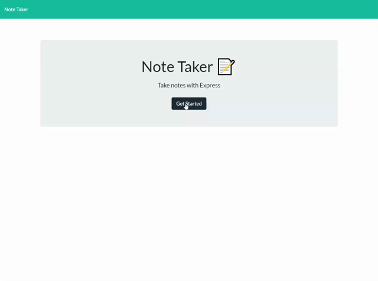

# Note Taker

  

Check out the badges hosted by [shields.io](https://shields.io/).

## Description:

A note taking application where you can write, save and delete notes.

## Table of Contents

- [Built With](#built-with)
- [Preview](#preview)
- [License](#license)
- [Author](#author)

## Built With:

 
 

## Preview:

[Link to Live Site](https://drive.google.com/file/d/1IGjDxhZRB691EL9jadxa-sfUIfiqWzzq/view)

## License:

## Author

Melanie Arnold
